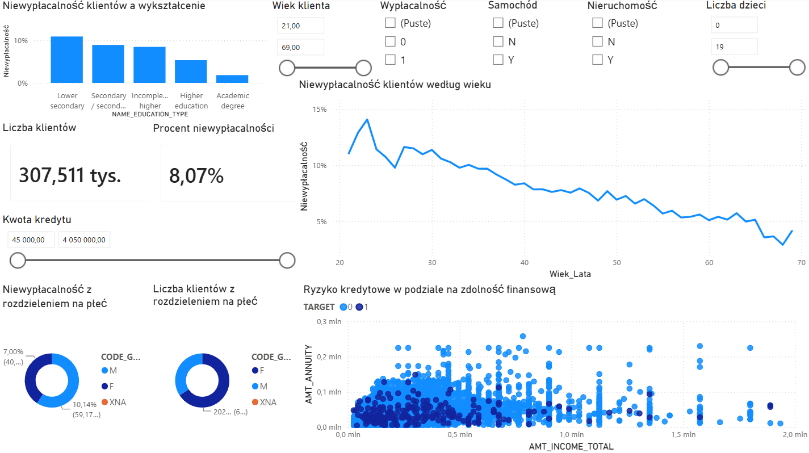
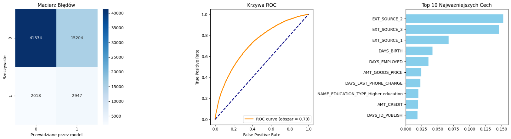

# Credit Risk Analysis & Prediction

## Podsumowanie

Niniejsze repozytorium zawiera kompleksowy projekt analityczny z obszaru oceny ryzyka kredytowego. Projekt składa się z dwóch zintegrowanych modułów:

1. **Modułu Business Intelligence (Power BI):** Interaktywnego dashboardu wspierającego kadrę zarządzającą w monitorowaniu portfela kredytowego oraz identyfikacji czynników ryzyka.
2. **Modułu Machine Learning (Python):** Modelu predykcyjnego, którego zadaniem jest oszacowanie prawdopodobieństwa niewypłacalności nowego klienta na podstawie jego profilu demograficzno-finansowego.

Analiza została przeprowadzona na zanonimizowanym zbiorze danych aplikacji kredytowych *Home Credit Default Risk* (ok. 307 tys. rekordów). Bazowy wskaźnik niewypłacalności w portfelu wynosi **8.07%**.

## Tech Stack

* **Business Intelligence:** Microsoft Power BI (DAX, Power Query)
* **Języki programowania:** Python 3.x
* **Machine Learning & Data Science:** `pandas`, `scikit-learn`, `matplotlib`, `seaborn`
* **Środowisko:** Google Colab
* **Wersjonowanie:** Git, GitHub 

## Część 1: Business Intelligence (Power BI)

Moduł BI pełni rolę analityki opisowej i diagnostycznej. Pozwala na dynamiczne badanie struktury portfela.


*(Powyżej: Główny interfejs analityczny wspierający decyzje kredytowe)*

**Kluczowe funkcjonalności dashboardu:**
* **Zaawansowane filtrowanie:** Mechanizm *Cross-filtering* umożliwiający symulowanie scenariuszy na podstawie m.in. wieku, kwoty kredytu czy liczby dzieci.
* **Analiza kohort demograficznych:** Mapowanie ryzyka w odniesieniu do poziomu wykształcenia oraz płci.
* **Wskaźniki DTI (Debt-to-Income):** Wizualizacja punktowa korelacji między całkowitym dochodem a obciążeniem ratą.

**Pliki:** `Raport Analityczny Ryzyko Kredytowe.pdf` oraz interaktywny `Credit_Risk_Analysis_Dashboard.pbix`.

## Część 2: Predictive Modeling (Machine Learning)

Celem modułu ML było zbudowanie modelu bazowego, który zautomatyzuje proces oceny wniosków kredytowych. Głównym wyzwaniem algorytmicznym był problem niezbalansowanych klas (klasa pozytywna ~ 8%).


*(Powyżej: Macierz błędów, krzywa ROC oraz analiza Feature Importance)*

**Metodologia i Architektura Modelu:**
1. **Data Preprocessing:** Obsługa braków danych oraz One-Hot Encoding.
2. **Stratified Split:** Podział zbioru na część treningową (80%) i testową (20%) z zachowaniem proporcji klas (`stratify=y`).
3. **Model:** Algorytm Random Forest Classifier.
4. **Optymalizacja:** Użycie parametru `class_weight='balanced'` w celu priorytetyzacji błędu na mniejszościowej klasie (niewypłacalnych klientach).

**Ewaluacja (Wyniki):**
* **ROC-AUC Score:** ~0.73 (solidny wynik bazowy na surowych danych).
* **Feature Importance:** Walidacja potwierdziła założenia z modułu BI. Top 3 najważniejszych czynników decyzyjnych to: oceny zewnętrzne (EXT_SOURCE), wiek klienta (`DAYS_BIRTH`) oraz wykształcenie.

**Plik:** `Przewidywanie_Ryzyka_Kredytowego.ipynb`

## Kluczowe Wnioski Biznesowe

1. **Wpływ wieku:** Najwyższe prawdopodobieństwo niewypłacalności (ok. 13-14%) notuje się u klientów w grupie wiekowej 20-25 lat. Ryzyko spada liniowo wraz z wiekiem.
2. **Edukacja jako twardy wskaźnik:** Zauważalna dysproporcja na niekorzyść klientów z wykształceniem podstawowym/gimnazjalnym (>10% wskaźnika default).
3. **Potencjał Automatyzacji:** Zbieżność wyników analizy opisowej (BI) z metryką *Feature Importance* modelu (ML) dowodzi wysokiej przewidywalności portfela.

## Instrukcja uruchomienia

**Opcja 1: Pobranie plików**
Najprostszym sposobem na zapoznanie się z projektem jest wejście w interesujący Cię plik (np. `.pbix` lub `.pdf`) w tym repozytorium i kliknięcie przycisku **"Download raw file"**.

**Opcja 2: Klonowanie repozytorium**
Ze względu na rozmiar pliku `.pbix` (Power BI), repozytorium korzysta z rozszerzenia Git LFS. Aby poprawnie sklonować cały projekt na swój dysk, upewnij się, że masz zainstalowane rozszerzenie Git LFS:

```bash
git lfs install
git clone git clone https://github.com/Maciek-Kowal/credit-risk-analysis.git
```

## Uruchomienie notatnika ML:

1. Pobierz plik Przewidywanie_Ryzyka_Kredytowego.ipynb i otwórz go w Google Colab.

2. Zbiór danych pochodzi z Kaggle (Home Credit Default Risk). Zaktualizuj ścieżkę do pliku application_train.csv w pierwszej komórce notatnika.
